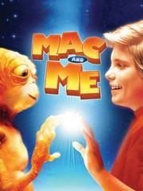

##Aquestes son les pitjor pel-lícules segons RottenTomatoes
### Mac and Me

**Critics Consensus:** Mac and Me is duly infamous: not only is it a pale imitation of E.T., it's also a thinly-veiled feature length commercial for McDonalds and Coca-Cola.
**Synopsis:** A young extraterrestrial, separated from its family and stranded on Earth, finds friendship with a boy in a wheelchair....
**Starring:** Christine Ebersole, Jade Calegory, Jonathan Ward, Tina Caspary
**Directed By:** Stewart Raffill
***
### In the Name of the King

**Critics Consensus:** Featuring mostly wooden performances, laughable dialogue, and shoddy production values, In the Name of the King fulfills all expectations of an Uwe Boll film.
**Synopsis:** As war looms in an idyllic kingdom, a man named Farmer (Jason Statham) begins a heroic quest to find his...
**Starring:** Jason Statham, John Rhys-Davies, Ray Liotta, Matthew Lillard
**Directed By:** Uwe Boll
***
### Material Girls

**Critics Consensus:** Plagued by paper-thin characterizations and a hackneyed script, Material Girls fails to live up to even the minimum standards of its genre.
**Synopsis:** Two sibling cosmetics heiresses (Hilary Duff, Haylie Duff) must grow up quickly when a company scandal leaves them penniless. Though...
**Starring:** Hilary Duff, Haylie Duff, Anjelica Huston, Brent Spiner
**Directed By:** Martha Coolidge
***
### BloodRayne

**Critics Consensus:** BloodRayne is an absurd sword-and-sorcery vid-game adaptation from schlock-maestro Uwe Boll, featuring a distinguished (and slumming) cast.
**Synopsis:** In 18th-century Romania, after spending much of her life in a traveling circus, human-vampire hybrid Rayne (Kristanna Loken) escapes and... [More]
**Starring:** Kristanna Loken, Michael Madsen, Michelle Rodriguez, Ben Kingsley
**Directed By:** Uwe Boll
***
### A Little Bit of Heaven

**Critics Consensus:** A Little Bit of Heaven subjects viewers to a whole bunch of schmaltz - and strands Kate Hudson and Gael García Bernal in a fatally misguided film.
**Synopsis:** New Orleans ad executive Marley Corbett (Kate Hudson) is a free-spirited woman who embraces her easy sexuality, shuns commitment, and... [More]
**Starring:** Kate Hudson, Gael García Bernal, Kathy Bates, Lucy Punch
**Directed By:** Nicole Kassell
***
